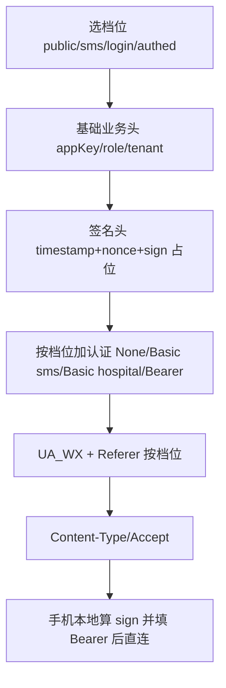

# 鼓楼医院 Skill（路径 A：代挂号）

查科室/医生/排班 → **代挂号**（持有短信 token）→ 给 `pay_url`，客户只确认付款。

## 功能
- 查科室/医生/排班/可约日期（公开）
- 挂号（⚠️真挂号）
- 我的就诊 / 病历 / 缴费 / 取消预约

## 接口来源
- **微信小程序抓包**（appid wx74a991a2ae77468d）+ 小程序代码逆向
- HTTP JSON；sign=SHA1(MD5(appKey+ts+nonce))；Bearer token 登录态

## ⚠️ 重要事项
- **挂号是真实操作会占号**，提交前确认
- **登录由系统自动处理**：短信 API（图形验证码 + 短信码），登录态 token 存手机授权中心，系统自动静默续期，AI 无需调用登录方法

## 登录态说明（核心难点）
- 登录由系统自动编排（`sms_verify`：图形码推聊天窗口 + 短信码），AI 不参与登录方法（login/get_graphical_captcha/send_sms 已标 system_only，对 AI 不可见）
- 登录态 = Bearer token + refresh_token，存手机授权中心；token 快过期自动用 refresh_token 静默续期

## 原子化 + 编码自动补全（本 skill 的设计）
- 全部方法都是**原子单元**，依赖关系写在 `contract.json` 的 `provides` / `requires` / `match` / `pass_params` 里。
- **编码由系统自动补齐**：`register` 需要的 dept_code / schedule_id / schedule_num_id / patient 等，系统自动现调 `list_depts` / `get_schedule` / `get_patient`，**用用户/ AI 给的名字（科室名/医生名/日期）精确匹配**后填入，AI 不需要抄编号。
- **匹配不到就明确报错**：如医生名在排班里找不到，skill_run 返回「未找到匹配项，请确认名称」，不会真的挂号。
- `register` 的 15+ 参数全部标注来源（来自 list_depts / get_schedule / get_patient），禁止 AI 编造编码。

## 核心难点 / 坑（给维护者看）
1. 挂号是真实操作会占号，提交前确认；
2. 登录走短信 API（图形验证码由真人看图输入，App 显示给用户），AI 不编排登录；
3. 接口需微信 UA + sign 签名（SHA1(MD5(appKey+ts+nonce))），错一个就失败；
4. `register` 参数必须来自前置查询（list_depts 定科室、get_schedule 定排班、get_patient 定患者），系统自动补齐，匹配不到如实报错；
5. get_patient 的 id_card 可能脱敏，挂号需完整证件信息（用户确认/补充）。

## 使用流程（老百姓视角）
问（要看哪个科/医生）→ 查（科室/排班）→ 填（患者信息）→ 提交（挂号，编码由系统补齐）→ 就诊/查报告。

## 使用要求
- 手机 App 在线
- 患者信息齐全（姓名/身份证/手机）

---

## 请求头（4 档位）

glyy 请求头按场景分 4 档。目标形态：`_base.py` 一张 `HEADER_PROFILES` + `_build_headers(profile)`，`login.py` 与 `_blueprint` 统一调用（勿再复制粘贴三份 headers）。

### 请求头总表

| 接口/场景 | 档位 | 认证方式 | 签名 | UA | Referer | 要 token |
|---|---|---|---|---|---|---|
| 查科室/医生/排班 | public | 无 | sha1_md5 | 微信手机 UA | 微信小程序页 | 否 |
| 图形码/发短信 | sms | Basic sms:smssecret | 同上 | 同上 | 同上 | 否 |
| 登录 login | login | Basic hospital:hospital-secret | 同上 | 同上 | **无** | 否 |
| 我的就诊/挂号/病历 | authed | Bearer token | 同上 | 同上 | 微信小程序页 | 是 |

现状代码：`public`/`authed` 在 `_base._blueprint`（靠 `bearer` 区分）；`sms`/`login` 在 `login.py` 内联。login 档故意不带 Referer，不要“顺手补齐”，除非手机实测确认更稳。

### 档位表（目标）

```python
HEADER_PROFILES = {
    "public": dict(auth=None,       sign="sha1_md5", referer=True,  desc="公开查询"),
    "sms":    dict(auth=BASIC_SMS,  sign="sha1_md5", referer=True,  desc="图形码/发短信"),
    "login":  dict(auth=BASIC_HOSP, sign="sha1_md5", referer=False, desc="手机号+短信登录"),
    "authed": dict(auth="bearer",   sign="sha1_md5", referer=True,  desc="已登录业务"),
}
```

### 拼装流程



### 常量说明

- `UA_WX`：非硬性要求（实测带/不带均可，见 CHANGELOG v2.1.0），保留兼容老站风控
- `REFERER`：微信小程序 `page-frame.html`；login 档不带
- `BASIC_SMS` / `BASIC_HOSP`：仅登录/发短信
- `sign`：`SHA1(MD5(appKey+ts+nonce))`，手机按 `sha1_md5` 算；云端只放占位符
- 铁律：glyy **禁云端直连**，拼头只在生成蓝图时用

### 新增接口 checklist

1. 判断档位（public / sms / login / authed）
2. 已有档位够用 → `_REQUEST_MAP` 加一行；`bearer` 区分 public/authed
3. 新认证方式 → `HEADER_PROFILES` 加档位并更新上表
4. 对外行为保持与现网 headers 一致后再重构拼装函数
