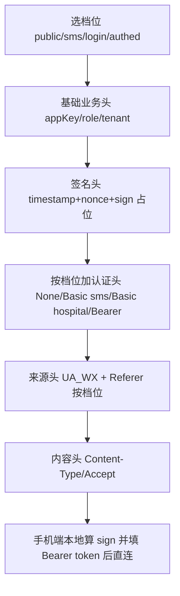

# glyy 请求头整理方案

> 目标：把 glyy 散落在 3 处的请求头定义收敛成「1 张档位表 + 1 个拼装函数」，并在文档里画清
> 楚「4 个档位的认证/签名/UA/Referer 差异」和「请求头拼装流程」，让维护者一眼看懂。
> 范围：只整理 glyy 自身，不做跨 skill 通用规范。

---

## 一、现状诊断：请求头散落在 3 处、共 4 种档位

glyy 实际有 **4 种请求头档位**，但代码里是**复制粘贴了 3 份几乎相同的 headers**：

| 档位 | 用途 | 代码位置 | 认证头 | 签名 | UA | Referer |
|---|---|---|---|---|---|---|
| public | 查科室/排班/医生（公开） | [`_base.py:85`](../cloud/cloud_orchestrator/adapters/skills/glyy/api/_base.py:85) | 无 | glyy_sha1_md5 | 微信手机UA | ✅ |
| authed | 我的就诊/挂号/病历（已登录） | [`_base.py:85`](../cloud/cloud_orchestrator/adapters/skills/glyy/api/_base.py:85) 带 bearer | Bearer token | glyy_sha1_md5 | 微信手机UA | ✅ |
| sms | 图形码/发短信 | [`login.py:20`](../cloud/cloud_orchestrator/adapters/skills/glyy/api/login.py:20) | Basic sms:smssecret | glyy_sha1_md5 | 微信手机UA | ✅ |
| login | 手机号+短信码登录 | [`login.py:85`](../cloud/cloud_orchestrator/adapters/skills/glyy/api/login.py:85) | Basic hospital:hospital-secret | glyy_sha1_md5 | 微信手机UA | ❌ 无 |

**核心痛点**：
1. 4 个档位只有 3 份代码，`public` 和 `authed` 共用 [`_blueprint()`](../cloud/cloud_orchestrator/adapters/skills/glyy/api/_base.py:82) 靠 `bearer` 参数区分；
2. `login` 档的 headers **少了 Referer**，这种细微差异只能人肉对比 3 份代码才发现；
3. 每个头是干嘛的、要不要签名、什么认证，全靠头部注释脑补。

---

## 二、设计：1 张档位表 + 1 个拼装函数

### 2.1 档位表 `HEADER_PROFILES`（放 `_base.py`）

```python
# —— glyy 请求头档位表（一个档位 = 一套完整请求头配方）——
HEADER_PROFILES = {
    # 档位     认证方式                 签名算法           Referer  用途说明
    "public": dict(auth=None,       sign="glyy_sha1_md5", referer=True,  desc="公开查询：查科室/医生/排班"),
    "sms":    dict(auth=BASIC_SMS,  sign="glyy_sha1_md5", referer=True,  desc="图形验证码 / 发短信"),
    "login":  dict(auth=BASIC_HOSP, sign="glyy_sha1_md5", referer=False, desc="手机号+短信码登录"),
    "authed": dict(auth="bearer",   sign="glyy_sha1_md5", referer=True,  desc="已登录：我的就诊/挂号/病历"),
}
```

> `auth` 取值：`None`（不加） / `"bearer"`（手机端填登录 token） / 具体 Basic 常量。
> `sign` 目前 glyy 全档位都是 `glyy_sha1_md5`，保留字段为将来可能的差异留位。

### 2.2 统一拼装函数 `_build_headers`（放 `_base.py`）

```python
def _build_headers(self, profile: str) -> dict:
    """按档位拼装请求头（含签名/UA/Referer/认证占位符，sign 等由手机本地计算）。"""
    p = HEADER_PROFILES[profile]
    h = {
        "User-Agent": UA_WX,                      # 来源头：兼容老站风控
        "appKey": APP_KEY, "role": ROLE, "tenant": TENANT,   # 基础业务头
        "timestamp": PH_TS, "nonce": PH_NONCE, "sign": PH_SIGN,  # 签名头占位
        "Content-Type": "application/json", "Accept": "*/*",    # 内容头
    }
    if p["referer"]:
        h["Referer"] = REFERER                    # 来源头：微信小程序页
    if p["auth"] == "bearer":
        h["Authorization"] = "Bearer " + PH_TOKEN
    elif p["auth"]:
        h["Authorization"] = p["auth"]
    return h
```

### 2.3 三处调用点统一改用它

| 现状 | 改为 |
|---|---|
| [`_blueprint()`](../cloud/cloud_orchestrator/adapters/skills/glyy/api/_base.py:85) 内联 headers | `headers = self._build_headers("authed" if bearer else "public")` |
| [`_sms_blueprint()`](../cloud/cloud_orchestrator/adapters/skills/glyy/api/login.py:20) 内联 headers | `headers = self._build_headers("sms")` |
| [`login()`](../cloud/cloud_orchestrator/adapters/skills/glyy/api/login.py:85) 内联 headers | `headers = self._build_headers("login")` |

---

## 三、文档模板（glyy/docs/README.md 新增一节）

### 3.1 glyy 请求头总表

| 接口/场景 | 档位 | 认证方式 | 签名 | UA | Referer | 要 token |
|---|---|---|---|---|---|---|
| 查科室/医生/排班 | public | 无 | ✅ | 微信手机UA | 微信小程序页 | 否 |
| 图形码/发短信 | sms | Basic sms:smssecret | ✅ | 微信手机UA | 微信小程序页 | 否 |
| 登录 login | login | Basic hospital:hospital-secret | ✅ | 微信手机UA | 无 | 否 |
| 我的就诊/挂号/病历 | authed | Bearer token | ✅ | 微信手机UA | 微信小程序页 | 是 |

### 3.2 请求头拼装流程（维护者必读）



### 3.3 常量说明（写进 `_base.py` 头部注释 + README）

- `UA_WX` = 微信手机 UA：**非硬性要求**（实测带/不带均正常，见 CHANGELOG v2.1.0），保留是为了「兼容老站风控」；
- `REFERER` = 微信小程序 `page-frame.html`：让服务端认成小程序流量，login 档不带；
- `BASIC_SMS` / `BASIC_HOSP` = base64 编码的用户名密码，只用于登录/发短信；
- `appKey=1340patient` + `timestamp/nonce/sign`：`sign=SHA1(MD5(appKey+ts+nonce))`，由**手机本地**按 `glyy_sha1_md5` 计算。

### 3.4 新增接口 checklist

1. 判断它属于哪个档位（公开 / 发短信 / 登录 / 已登录）；
2. 若已有档位满足 → 直接在 `_REQUEST_MAP` 加一行，`bearer` 参数决定 public 还是 authed；
3. 若是全新认证方式 → 在 `HEADER_PROFILES` 加一个新档位，并在总表补一行；
4. 更新请求头总表。

---

## 四、落地清单（改哪些文件）

| 文件 | 改动 |
|---|---|
| [`_base.py`](../cloud/cloud_orchestrator/adapters/skills/glyy/api/_base.py) | 加 `HEADER_PROFILES` + `_build_headers()`；`_blueprint` 改用拼装函数；头部注释补档位说明 |
| [`login.py`](../cloud/cloud_orchestrator/adapters/skills/glyy/api/login.py) | `_sms_blueprint` / `login` 改用拼装函数 |
| [`README.md`](../cloud/cloud_orchestrator/adapters/skills/glyy/docs/README.md) | 新增「请求头总表 + 拼装流程 + 常量说明 + 新增接口 checklist」 |

## 五、注意事项

- **对外行为保持不变**：public/authed/sms 档的 headers 拼出来与原代码逐字段一致；login 档保持「无 Referer」——不要顺手"补齐"，除非手机实测确认加上更稳；
- 签名（`sign_type: glyy_sha1_md5`）仍由手机端计算，云端只放占位符；
- 铁律不变：glyy 禁云端直连，`_build_headers` 只在生成蓝图时用。
