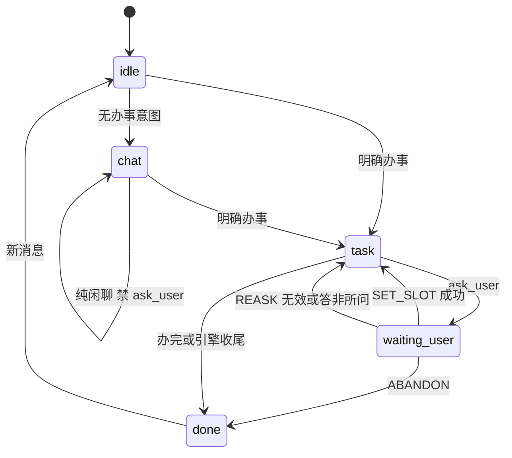

# 「随心所欲不偏离轨道」· 架构规划（Orchestrator 中心版）

> 目标：让虾米办事 Agent 对话体验向 **Zoo 式**靠拢——回复自然、有语气、接得住闲聊/答非所问/打断/改主意（随心所欲），同时办事目标、平台指定、字段收集绝不丢、绝不越权（不偏离轨道）。
> 根治手段：**把「用户一句话进来之后谁说了算」从模型手里收回到引擎状态机**。模型只负责自然语言层发挥（Zoo 式语气），不再兼任流程裁判。
> 状态：规划定稿方向（Orchestrator 中心）；§10 待明确项需拍板后进入 PR 实施。

---

## 1. 根因：四类问题同源（LLM 兼任流程裁判）

现有链路：

```
用户答 ask_user → feed_answer 原样喂回 → ToolMessage answer:xxx
  → LLM 自己决定：写 form / 继续问 / done
form 写入靠 match_answer「只缺一项就整句写入」——没有校验
```

四类压测 FAIL 同源：

| 现象 | 同源 |
|---|---|
| 「算了不买了」→ 还问到达地 | 引擎把「放弃」当 slot 值，LLM 继续填表 |
| 「今天几点了」→ 写进出发地 | 同上，无 schema 校验 |
| 「东京热不热」→ ask_user | 工具面全程暴露，LLM 可随便 ask |
| 「鼓楼」→ 推荐浦口 → 拒绝后丢弃 | 无会话级 skill/实体锁，search 可换 skill |

**结论**：不是词表不够，是「执行权」没从 LLM 收回来。词表只是补丁。

---

## 2. 根治目标：一句话进来，谁说了算

在 `master.submit` / `feed_answer` 与 `Agent.handle` 之间，加**唯一入口**：

```
DialogueOrchestrator.handle_turn(user_msg, session_state) -> TurnOutcome
```

铁律：
- 有 `pending_ask` 时，用户回复**先过编排器**，不许直接进 LLM 当 slot。
- 编排器输出**结构化 Command**，引擎确定性执行；LLM 只收到「已执行结果 + 该怎么说话」的上下文。
- 工具面随 phase 变（闲聊轮不暴露 ask_user / skill_run）。
- 状态落会话（conversations），不只 Agent 实例内存。

> 与 Rasa CALM、WorkBuddy Stop/Gate 同一思想：**理解可以靠 LLM，执行必须听引擎。**

**用 LangGraph 底座，不自造 Orchestrator 外壳**：虾米已经用 LangGraph，它原生就带我们要的四样东西——
- `StateGraph` + 多节点 / conditional edges = 状态机（phase 路由）；
- `checkpointer` = 状态落盘（解决重启一致性 C3）；
- `interrupt()` + `Command(resume=...)` = 等人输入（替代自造 `_answer_waiter` + Future）；
- `Command` 原语 = 控制节点走向（与我们「Command 总线」同名同义）。

所以「唯一入口」不是另写一个 `DialogueOrchestrator` 类，而是**把现有 graph_engine 的最简 ReAct 升级成显式状态机**；`handle_turn` 退化为「把新消息 / 回答作为 graph 的一次 resume 输入」。业务判定（AnswerCheck / ABANDON / SkillLock）写成普通节点 / 纯函数——**这些 LangGraph 不提供，要自己写**。

---

## 3. 核心架构：LangGraph 状态机 + DialogueState + Command 总线

### 3.1 会话级 DialogueState（扩展现有 Conversation）

已有 `forms`、`steps`，缺的是**对话相位**。在 Conversation 上增：

```jsonc
"dialogue": {
  "phase": "idle | chat | task | waiting_user | done",
  "locked_skill": null,              // 如 "glyy"（SkillLock）
  "lock_reason": "",                 // user_said_鼓楼 / skill_run_confirmed
  "lock_entity": {},                 // 如 {"hospital": "鼓楼"}
  "pending_ask": null,               // 等待中的提问
  "abandoned": false,
  "chat_streak": 0                   // 可选：连续闲聊轮计数
}
```

`pending_ask`（非空时 = 会话正在等人回答）：

```jsonc
{
  "ask_id": "...",
  "skill": "tuniu",
  "field": "departure",             // 契约 form.field
  "label": "出发城市",
  "type": "text",                   // 来自 contract
  "question": "...",
  "attempt": 0,
  "max_attempts": 3
}
```

> `current_skill` 从 Agent 内存迁到会话——否则拒浦口、锁鼓楼无法跨轮。

### 3.2 状态机（根治主干）



关键：`waiting_user → task` 只有编排器发出 `SET_SLOT` 才走，**不是 LLM 说写就写**。

### 3.3 用户回复解析：Command 总线（不是词表）

`pending_ask` 存在时，`resolve_reply(text, pending, form_schema, card)` 返回 `Command`（纯函数 + 可单测）：

| Command | 何时 | 引擎动作（零 LLM） |
|---|---|---|
| `ABANDON` | 放弃当前办事 | phase=done，清 pending，不写 form，模板收尾 |
| `SET_SLOT(field,value)` | 通过 AnswerCheck | 写 `forms[skill][field]`，清 pending，注入「已填 X=Y」 |
| `REASK(reason)` | 答非所问 / 校验失败 | attempt++；超限 → ABANDON 或转人工；否则带 reason 再进 ReAct |
| `OFF_TOPIC_CHAT` | 办事中插一句闲聊 | 引擎模板短答后 REASK 原 field（接住 + 不丢目标） |
| `NEW_INTENT` | 「帮我把订单取消」 | 清 pending，交 ReAct 走新 flow（≠ ABANDON） |
| `DELEGATE` | 规则都拿不准 | 唯一交给 LLM 结构化判断（见 §4） |

放弃判定（ABANDON）——上下文规则，不是 500 词表：
- 有 pending_ask + 短句高置信放弃 + 无转折词 → ABANDON；
- 有 pending_ask + 「帮我把…取消」 → NEW_INTENT（不是 ABANDON）。

**判定原理（分层漏斗，schema 校验为主，不是关键词表）**：

`resolve_reply` 按顺序过四道，**前一道命中就不再往下**：

```
① AnswerCheck（schema 校验）——主裁判，确定性
   回答能不能合法填进 pending_ask.field（按契约 type / validation）？
   「南京」→ 能填 departure → SET_SLOT
   「几点了」→ 不能填（不是城市实体）→ 校验失败，往下走
② 意图规则（少量，非大词表）
   命中放弃规则 → ABANDON；命中「帮我把…取消」→ NEW_INTENT
③ 跑题归类
   校验失败 + 非放弃 + 非新意图 → 看闲聊特征
   含时间/天气等闲聊信号 → OFF_TOPIC_CHAT（模板短答 + REASK 原 field）
   其余答非所问 → REASK（attempt++，到上限才收尾）
④ DELEGATE（<5% 兜底）
   以上都拿不准 → 同一轮 LLM 结构化判断（JSON 出 Command 建议），仍由引擎执行
```

**「几点了 → OFF_TOPIC」到底怎么来的**：它**不在任何词表里**。它是「填不进 departure 字段」这个 schema 校验失败 + 「不是放弃」的排除 + 「含时间闲聊信号」的归类，三步落到 OFF_TOPIC。这就是"校验优先、规则兜底、LLM 只打杂"的原理——**主裁判是 AnswerCheck，不是关键词**。

### 3.4 AnswerCheck（根治答非所问）

按契约 `form[].type` / `validation` 做确定性校验，**只缺 1 项也不能跳过**（修 `match_answer` 漏洞）：

- `departure` + 回答含「几点/天气」 → REASK；
- `departure` + 「算了不买了」 → ABANDON；
- `date` → 走现有 `date_utils`；
- 通过校验才 `SET_SLOT`，否则不写 form。

### 3.5 SkillLock（根治鼓楼→浦口）

用**已有** [`card.json`](cloud/cloud_orchestrator/store/archive_center/skill_archive/jintao/card.json) 的 `intents`，不造新词表：

- 用户话命中 skill intent → `LOCK_SKILL(skill, reason)`；
- 已 lock 时 `search` / `skill_run` 非 lock skill **直接拒绝**（引擎报错，非 prompt）；
- 用户「否，我就要鼓楼」→ 强化 lock，**禁止 done 丢任务**。

---

## 4. LLM 的位置（仍是单 Agent，不套娃）

| 环节 | 谁做 |
|---|---|
| ABANDON / SET_SLOT / REASK / LOCK / 工具拒绝 | 引擎 |
| 自然语言怎么问、怎么接住、怎么解释 | 同一个 ReAct LLM |
| 「算放弃还是转折」且规则返回 DELEGATE | 同一轮 LLM 调 `classify_reply` 工具（JSON 输出，非第二个对话 Agent） |

> DELEGATE 应 <5%；规则 + schema 覆盖 95%，LLM 不当主裁判。
> DELEGATE 的 LLM 判断结果仍回 **Command 总线由引擎执行**——LLM 只出建议，不出手。

---

## 5. 工具面 gating（根治「东京热」）

| phase | 暴露工具 |
|---|---|
| `chat` | `search(web)`、`done`；**无 ask_user、无 skill_run** |
| `task` | 全工具，但 `skill_run` 受 `locked_skill` 约束 |
| `waiting_user` | **不跑 ReAct**；只跑 `resolve_reply → Command` |

> hired 会话里也有 chat phase：「东京热不热」在 task 未锁定前走 chat，物理上调不了 ask_user。
> 衔接现有 search：`chat` phase 允许 `search(scope=web)`（现有代码 hired 下默认 scope=skill，需按 phase 放开）。

---

## 6. 改造地图（现有代码怎么接，不是重写）

| 现有 | 改造 |
|---|---|
| [`feed_answer`](cloud/cloud_orchestrator/core/master.py:53) | → 变成 `graph resume` 的入口（把回答作为 resume 值喂回 interrupt） |
| [`master.submit`](cloud/cloud_orchestrator/core/master.py:240) | → 变成「新消息 → 启动 / resume graph」；无 pending 时路由 chat/task |
| [`agent._store_form_answer`](cloud/cloud_orchestrator/core/agent.py:794) | → 删权；只有 `SET_SLOT` 命令能写 form |
| `agent._asked_norm` 一刀切去重 | → 换成 `pending_ask.attempt + max_attempts` |
| `Agent.current_skill`（内存） | → 读写 `Conversation.dialogue.locked_skill` |
| [`graph_engine.build_tools`](cloud/cloud_orchestrator/core/graph_engine.py:67) | → 按 phase 过滤工具列表 |
| `form_state.match_answer` | → 并入 AnswerCheck，校验通过才 SET_SLOT |
| LangGraph 底座 | **用满**：StateGraph 多节点 / `interrupt` 替代 ask_id+Future / checkpointer 落盘 / `Command` 路由 |

---

## 7. 模块划分（LangGraph 原生 + 业务纯函数）

**流程编排（用 LangGraph 原生，不自造）**：
- `graph_engine.py` 重构：最简 ReAct（model/tools/correction）→ 显式状态机（多节点 + conditional edges）；
- `interrupt()` / `Command(resume)` 替代 `master._make_ask` 的 ask_id + Future；
- `checkpointer`（PR-0 用 MemorySaver 保持现状语义，后续换 SqliteSaver 得重启恢复）。

**业务判定（自己写的纯函数，LangGraph 不提供）**：
```
cloud/cloud_orchestrator/core/dialogue/
├── state.py          # DialogueState schema（LangGraph state 定义）
├── commands.py       # Command 枚举 + 执行器（纯函数）
├── resolve_reply.py  # pending_ask 回复 → Command（规则 + AnswerCheck）
├── route_entry.py    # 新消息 → chat | task（card intents + 简单特征）
├── skill_lock.py     # LOCK / enforce（读 card.json）
└── config.py         # guard.* 开关（可回滚）
```

> 不是 `reply_intent.py` 一个文件打天下，也不是自造第二套编排器；是「LangGraph 管流程 + 纯函数管判定」。

---

## 8. 验收（四类 FAIL 一次对齐）

| 用例 | 根治机制 |
|---|---|
| 「算了不买了」 | ABANDON，不写 form |
| 「今天几点了」 | REASK 或 OFF_TOPIC_CHAT+REASK，不写 form |
| 「东京热不热」 | phase=chat，无 ask_user 工具 |
| 「鼓楼」→ 拒浦口 | LOCK_SKILL(glyy) + skill_run 闸门 |
| G-01…G-11 | phase=task 全工具，AnswerCheck 不误伤正常城市名 |

---

## 9. 实施顺序（架构一次定稿，实现分 PR）

| PR | 内容 | 依赖 |
|---|---|---|
| **PR-0** | DialogueState + orchestrator 骨架 + 开关 | 无 |
| PR-1 | feed_answer / submit 改走 orchestrator；form 只经 SET_SLOT | PR-0 |
| PR-2 | AnswerCheck + REASK + attempt 上限 | PR-1 |
| PR-3 | ABANDON + NEW_INTENT 分流 | PR-1 |
| PR-4 | SkillLock（card intents） | PR-1 |
| PR-5 | route_entry chat/task + 工具 gating | PR-0 |
| PR-6 | prompt 瘦身（删掉引擎已管的铁律） | PR-1…5 |

> **不做「只上线词表就称阶段 1 完成」**——那是糊弄。要 PR-0 + PR-1 上线后「算了不买了」才稳；PR-2…4 扫其余 FAIL。

---

## 10. 待明确项（审出：3 冲突 + 4 补充，需拍板）

### 冲突 C1：DialogueState.phase 与 TaskState.status 两套状态

现有 [`TaskState.status`](cloud/cloud_orchestrator/core/master.py:84)（idle/running/waiting_user/done/failed/cancelled，内存、单任务）与新的 `dialogue.phase`（会话级、落盘）存在映射关系，必须画清，否则两状态机打架。

**建议（用 LangGraph 底座后更简单）**：`dialogue.phase` = LangGraph state 里的权威字段；`TaskState` 退化为「给 App 推送的对外任务视图」，由 graph 节点在执行时同步写入。映射：`phase=waiting_user ↔ status=waiting_user`、`phase=task ↔ status=running`、`phase=done ↔ status=done`、`phase=chat ↔ status=idle`。

### 冲突 C2：SkillLock 的 card intents 有重叠

[`card.json`](cloud/cloud_orchestrator/store/archive_center/skill_archive/jintao/card.json) 里 `glyy.intents` 与 `njpkzyy.intents` 都含「挂号」——用户说「我要挂号」会同时命中两个 skill，「命中唯一才 LOCK」不成立。

**建议**：只把**强实体词**（医院名/平台名：鼓楼、浦口、中医院、美团、途牛）作为 LOCK 依据；泛词（挂号、点餐、买票）只用于 phase 路由，不用于 LOCK。

### 冲突 C3：pending_ask 落盘 vs Future 内存不一致

`pending_ask` 落盘在会话，但 `_answer_waiter` 的 asyncio.Future 在内存。服务重启后 pending_ask 还在、Future 丢了，用户回答会找不到 waiter。

**建议（用 LangGraph 底座后天然解决）**：`interrupt()` 自带 checkpoint——图暂停时把整个 state 落盘（含 pending_ask），resume 时从 checkpoint 恢复，**不再需要自造 Future**。PR-0 先用 `MemorySaver`（保持单 worker 现状语义）；要跨重启恢复就换 `SqliteSaver`（本地文件），一行配置的事，不作为本次必需。

### 补充 S1：OFF_TOPIC_CHAT 的「短答」谁生成

「几点了」这类插话，waiting_user 不跑 ReAct。建议**引擎模板答**（复用现有 [`clock_note`](cloud/cloud_orchestrator/core/agent.py:145) 注入的当前时刻），不额外开 ReAct，保持零 LLM。

### 补充 S2：DELEGATE 闭环

LLM 的 `classify_reply` 只输出 Command 建议，**仍由引擎执行**；LLM 绝不直接写 form / 切 skill / 调 ask_user。闭环要写死在 orchestrator。

### 补充 S3：SET_SLOT 只管 customer 字段

`SET_SLOT` 只覆盖 `form[].source=customer` 的字段；`auto` 字段仍走现有 [`_fill_requires`](cloud/cloud_orchestrator/core/agent.py:295) 现调源头；`profile` 由手机资料卡填。三者边界在 PR-1 写清。

### 补充 S4：chat phase 与 search scope 衔接

`chat` phase 需放行 `search(scope=web)`；现有 [`search`](cloud/cloud_orchestrator/core/agent.py:354) 在 hired 下默认 scope=skill 会拒绝。PR-5 需一并改该分支。

---

## 11. 风险与回滚

- **误伤**（正常消息被判 ABANDON/闲聊）：靠 Command 纯函数单测兜底 + `guard.*` 开关分项回退。
- **改动面大**：按 PR 分步，每 PR 独立开关、可回退到原始行为；PR-0 只加骨架不改行为。
- **不套娃**：坚持单 Agent ReAct；Orchestrator 是循环外的确定性状态机，不开第二个对话 Agent。
- **prompt 瘦身放最后**（PR-6）：先让引擎接管约束、验证稳定，再删提示词里已冗余的铁律，避免语气退化。
